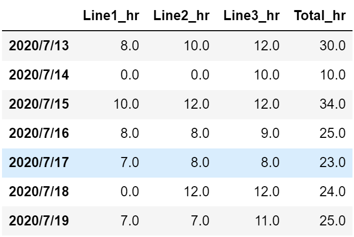
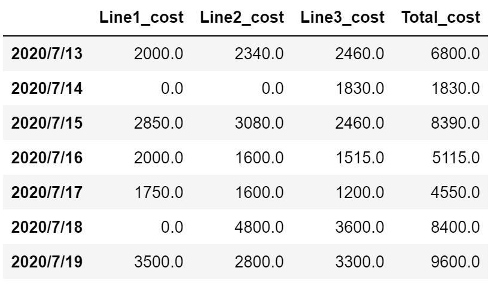

# Optimization of Production Planning with Gurobi
Here Python and Gurobi optimization solver are utilized to optimize production planning for a factory with three production lines and reduce the total labour costs.

The input is the daily requirement in number of hours to allocate between 3 different production lines for a period of one week. Capacity is the same for all production lines but hourly cost is different as production lines 2 & 3 were added later with more modern equipment and thus more energy efficient. Due to their labour union agreement, if any of the production lines is scheduled to be open, it is required to operate for a minimum of 7 hours for that day. Also, due to the power switches none of the production lines can operate more than 12 hours per day.

The concept of overtime and weekend extra cost is also considered in the model. Hours worked from 8 to 12 hours are paid 50% higher and hours worked during weekends are paid double. The equipment in each production line are designed for 8 hours of work per day and therefore, there is an extra cost associated for overtime which is different for each line according to their efficiency design.

Considering all of the mentioned variables, the most cost-efficient production planning will be identified using Gurobi optimization solver.

## Problem Description

As explained above, the factory possesses three production lines with more advanced technologies for more recent production lines of 2 & 3 which resulted in different operation cost for regulars hours and overtime. The hourly labor cost is 250$/h for lines 1, 200$/h for line 2, and 150$/h for line 3. The overtime extra cost associated for lines 1, 2 and 3 are 50$/h, 70$/h, and 90$/h, respectively. Due to the current rules and regulations, there are some constraints on the daily working hours: one line cannot run for less than 7 hours. Due to power switch recommendation each line can operate up to a maximum of 12 hours per day.

The requirement from customers are the number of hours of production for each day of a week, and the required hours will be scheduled such that it minimize the total cost. 

## Project Structure and Sections

This project is an implementation of Gurobi optimization solver to identify the  most cost-efficient production planning. Following is the project structure and list of sections:

* Section 1: Input Data
* Section 2: Initiate the model and create the variables
* Section 3: Set up the constraints¶
* Section 4: Create objective function and solution
* Section 5: Visualizing of the results

The optimized hours and cost of each production line for each day identified by the Gurobi solver were printed in a dataframe structure as follows:

Optimized hours for each of the production lines

Optimized cost for each of the production lines

## Dependencies
* Pandas
* Gurobi 

How to use?
===========
The project is developed in Jupyter Notebooks which is automatically rendered by GitHub. The developed codes and functions for each step are explained in the notebook.

